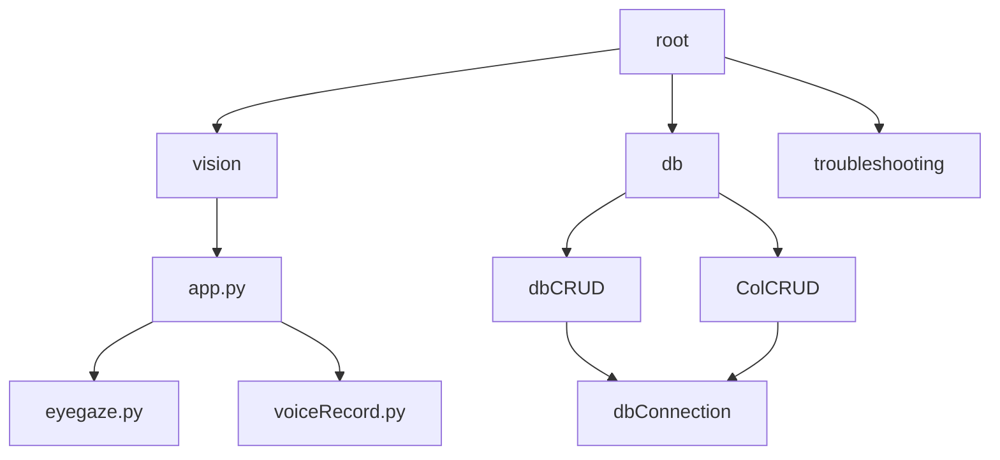
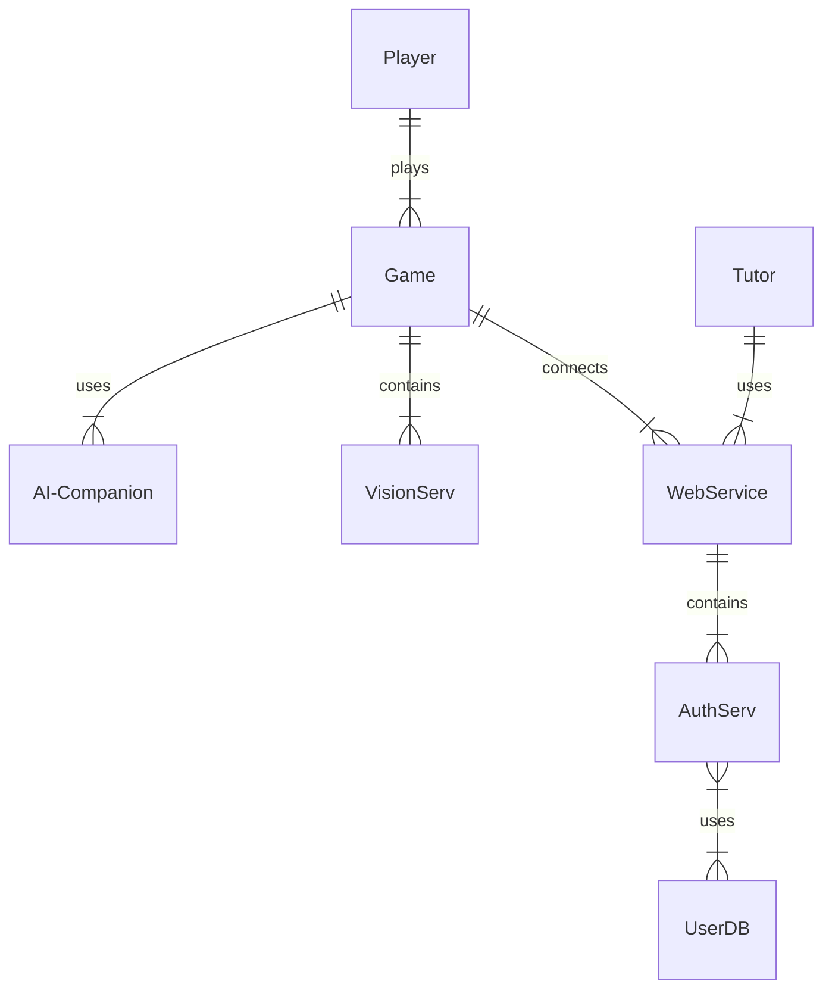

File structure:

```mermaid
graph TD;
    root-->vision;
    root-->db;
    root-->troubleshooting;
    vision-->app.py;
    app.py-->eyegaze.py;
    app.py-->voiceRecord.py;
    db-->dbCRUD;
    db-->ColCRUD;
    dbCRUD-->dbConnection;
    ColCRUD-->dbConnection;
```

Application Workflow:

```mermaid
erDiagram
    Game ||--|{ AI-Companion : uses 
    Player ||--|{ Game : plays
    Game ||--|{ VisionServ : contains
    Game ||--|{ WebService : connects 
    Tutor ||--|{ WebService : uses
    WebService ||--|{ AuthServ : contains
    AuthServ }|--|{ UserDB : uses
```